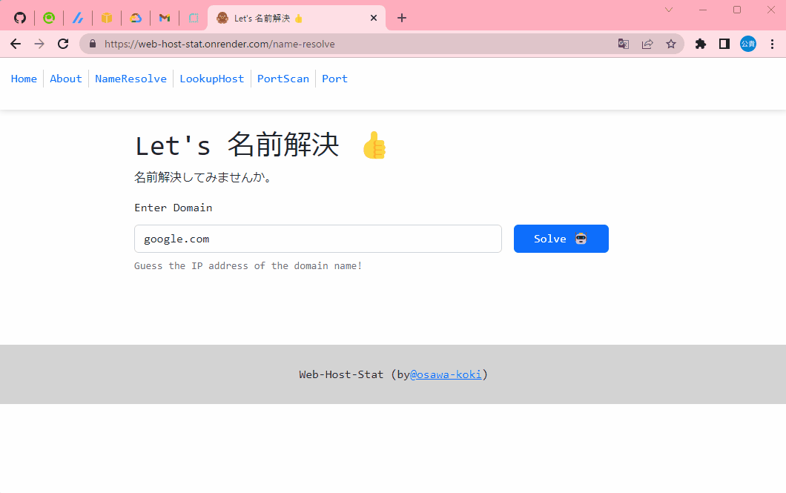

# web-host-stat

Webホストに関するイロイロな情報をチェックするサイト。  
Go × Next.jsで実装。  

  

## 実行方法

```shell
# デバグ実行
$Env:APP_ENV="dev" && swag init && go run main.go
```

Dockerを使用するなら、、、  

```shell
docker build -t web-host-stat .
docker run -p 80:80 -it --rm --name my-web-host-stat web-host-stat

# 一行で書くと、、、
docker build -t web-host-stat . && docker run -p 80:80 -it --rm --name my-web-host-stat web-host-stat
```

Dockerでの開発用(サーバのみ)実行は、、、

```shell
docker build -t web-host-stat-dev -f Dockerfile.dev .
docker run -p 80:80 -it --rm --name my-web-host-stat-dev web-host-stat-dev

# 一行でビルド&実行を行う
docker build -t web-host-stat-dev -f Dockerfile.dev . && docker run -p 80:80 -it --rm --name my-web-host-stat-dev web-host-stat-dev
```

---

以下の2つの同時に実行することで本番環境と同じ環境を構築可能。  
「$」はカレントディレクトリを、「~」はリポジトリルートを意味する。  

```shell
# $ ~/
Env:APP_ENV="dev" && swag init && go run main.go

# $ ~/web_client
yarn dev
```

## デプロイ設定

| キー | バリュー |
| ---- | ---- |
| Name | web-host-stat |
| Region | Oregon(US West) |
| Branch | main |
| Root Directory |  |
| Environment | Docker |
| Dockerfile Path | ./Dockerfile |
| Docker Build Context Directory |  |
| Docker Command |  |
